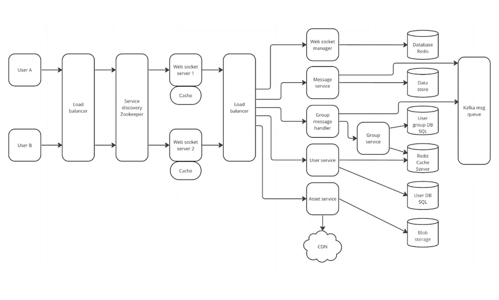

#### 채팅 서비스 만들기

#### 1. 유저의 채팅방 접속 시간 캐싱

- 자주 변경되고 자주 조회되므로 write back 패턴
  
  - 캐시를 모아놨다가 배치 작업으로 DB에 반영
  
  - 데이터 정합성 확보

- READ THOURGH 패턴
  
  - 캐시에서만 데이터를 읽어온다
  
  - 읽기가 많은 워크로드에 적합

- 접속 여부와 접속 마지막 시간을 저장

- 유저가 처음 채팅방접근시 해당방의 접속 정보 전달
  
  - 구독은 로그인시 바로

- 이후 읽은 수와 읽은 사람은 클라이언트단에서 처리

- 서버에서는 접속 정보만 전달

- 밤에 배치처리

[[REDIS] 📚 캐시(Cache) 설계 전략 지침 💯 총정리](https://inpa.tistory.com/entry/REDIS-%F0%9F%93%9A-%EC%BA%90%EC%8B%9CCache-%EC%84%A4%EA%B3%84-%EC%A0%84%EB%9E%B5-%EC%A7%80%EC%B9%A8-%EC%B4%9D%EC%A0%95%EB%A6%AC)

#### whatsapp

**websocket server**

- 웹소켓 연결만

- http method로 다른 서비스로
  
  - 메세지 관련도 ->  성공 여부 파악하기 위해 kafka를 안쓰는거 같아요

- websocket session 인메모리 캐싱

**websocket manger**

- 유저가 접속중인 웹소켓 서버 정보 저장

**Message service**

- 메세지 저장 

- 메세지 kafka와 웹소켓 통신으로 전송

**group massage handler**

- 채티방 관련 서비스

- 읽음 처리, 방 유저 1:N 관계, ...

**user service**

- 계정 관련 서비스

**asset service**

- 이모티콘이나 사진 관련?

#### 서비스 플로우

1. 메세지를 보낸다

2. 해당 채팅방 정보를 가져온다
   
   1. redis에 없으면 캐싱 expire 1시간? 2시간?
   
   2. redis에 있다면 가져오기

3. 유저의 접속 정보를 토대로 로직 
   
   1.  접속 중이면 websocket manger와 연결된 redis에서 접속중인 websocket server 정보 받아오기
   
   2. 해당 서버에서 전송해야하는 유저 정보와 메세지를 토대로 전송
      
      1. 그사이에 접속 종료했을수도 있으니 예외처리
   
   3. 웹소켓 서버에서 메세지 받으면 stomp로 전송
   
   
