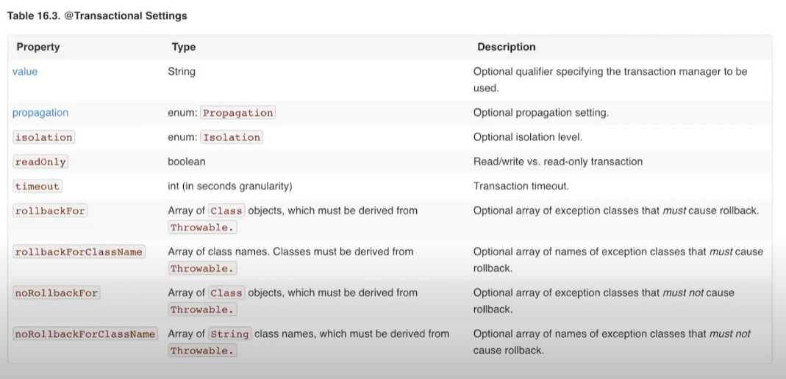

# 트랜잭션

**여러 쿼리를 논리적으로 하나의 작업으로 묶어주는 것**

### ACID

원자성: 모두 반영or  반영X

일관성: 항상 일관된 상태 유지

독립성: 트랜잭션은 각각 독립적

지속성: 트랜젹션 성공시 영구적으로 반영

## 트랜잭션 격리 수준

#### read-uncommitted

커밋전의 트랜잭션의 데이터 변경 내용을 다른 트랜잭션에서 읽음

rollback시 무효화된 데이터를 읽어요 -> dirty read

#### Read-committed(non-repeatable read)

커밋된 데이터만 읽기

트랜잭션 내부에서 읽은 값들이 다를 수있다(트랜잭션중 다른 트랜잭션이 커밋됬을때)

#### Repeatable-read

커밋 완료된 데이터만 읽음

트랜잭션 내부 데이터는 항상 일치

팬텀 리드 ->Non-Repeatable Read의 한 종류로 **조회해온 결과의 행이 새로 생기거나 없어지는 현상**

#### serializable

acid 엄격히 

락이 걸려 데이터 접근X

성능 떡락

#### default: db의 기본값 사용

## @transactional(timeout=)

예외 발생시켜 롤백

### @transactional(readOnly =)

수정 방지

flush 모드 메뉴얼 -> jpa dirty check X ->성능 올라감

#### @transactional(rollbackFor =)

특정 예외 롤백

#### @transactional(noRollbackFor =)

특정 예외 롤백  X

## propagation 트랜잭션 전파

required

- 트랜잭션 생성 혹은 기존 트랜잭션 참여

supports

- 있으면 참여 없으면 생성

mandatory

- 있으면 참여 없으면 에러

- 혼자 트랜잭션 시작X

requires_new

- 항상 새로운 트랜잭션 생성

- 기존 트랜잭션 보류후 새로운 트랜잭션 생성

not supported

- 트랜잭션 없이 진행

- 기존 트랜잭션 보류후 그냥 진행

NEVER

- 트랜잭션을 사용하지 않음(기존 트랜잭션도 허용하지 않음)
- 기존 트랜잭션 없음: 트랜잭션 없이 진행
- 기존 트랜잭션이 있음: IllegalTransactionStateException 예외 발생

NESTED

- 의미: 중첩(자식) 트랜잭션을 생성

- 기존 트랜잭션 없음: 새로운 트랜잭션을 생성함

- 기존 트랜잭션이 있음: 중첩 트랜잭션을 만듬

- 부모 트랜잭션에 영향을 받지만 자신은 영향을 주지 않음

**트랜잭션없이 진행시 변경사항 바로바로 커밋**

`@Transactional(readOnly = true)` 옵션을 사용해도 애플리케이션 레벨에서의 엔티티 변경을 완전히 방지하지는 못합니다. 이를 방지하기 위해서는 코드를 명시적으로 관리하고, 읽기 전용 트랜잭션 내에서는 수정 작업이 일어나지 않도록 주의해야 합니다.

`START TRANSACTION READ ONLY;`

JPA(Java Persistence API)에서 더티 체크(Dirty Checking)는 영속성 컨텍스트(persistence context)에서 관리되는 엔티티 객체의 상태 변화를 자동으로 감지하여, 트랜잭션이 커밋될 때 변경된 내용을 데이터베이스에 반영하는 메커니즘입니다. 더티 체크는 JPA의 중요한 기능 중 하나로, 엔티티의 상태 변경을 추적하여 개발자가 직접 데이터베이스 업데이트 쿼리를 작성하지 않아도 되도록 합니다.

