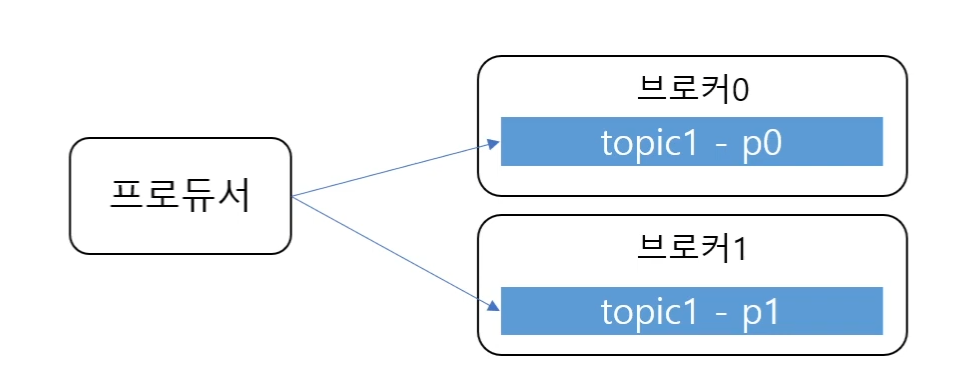
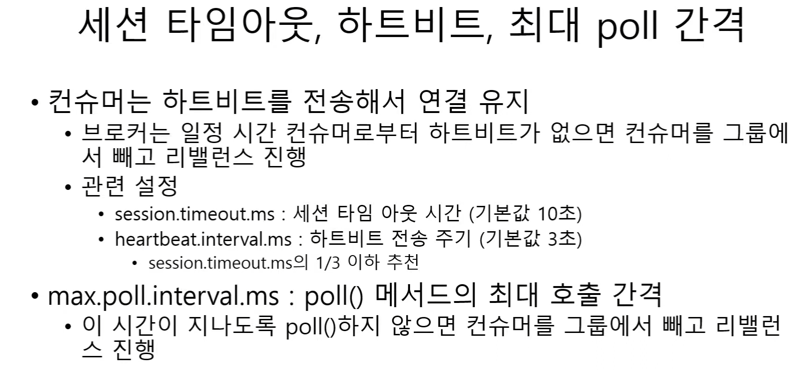

# 카프카 조금 아는 척하기 1

**카프카: 분산 스트리밍 고성능 플랫폼**

포춘 100대 기업중 80개의 기업이 사용중

### 기본구조

카프카 클러스터: 메세지 저장소

브로커: 각각의 메세지를 나눠서 저장 및 장애 대응

주키퍼 클러스터: 카프카 클러스터 관리

프로듀서: 메세지 카프카에 넣음

컨슈머: 메세지를 카프카에서 읽음

### 토픽과 파티션

토픽: 메세지를 구분하는 단위

한개의 토픽은 한개 이상의 파티션으로 구성

파티션은 메시지를 저장하는 물리적인 파일

파티션은 append-only 파일

각각의 메세지가 저장되는 위치 -> offset

컨슈머는 오프셋 기준으로 메시지를 순서대로 읽음

메세지는 삭제X(설정에 따라 다름)

### 파티션과 프로듀서

프로듀서가 라운드로빈 혹은 키로 파티션 선택

컨슈머는 컨슈머 그룹에 속함

**한개의 파티션은 컨슈머그룹의 한개의 컨슈머만 연결 가능**

### 성능

파티션 파일은 os 페이지캐시 사용 -> 파일 io가 메모리에서 처리

zerocopy 디스크 버퍼에서 네트워크 버퍼로 직접 데이터 복사

브로커의 하는 일이 단순

묶어서 보내고 받음(batch)

수평확장 쉬움

### 리플리카

파티션의 복제본

복제수만큼 파티션의 복제본이 각 브로커에 생김

리더와 팔로워로 구성

- 리더를 통해 메세지 처리

- 팔로워는 리더로부터 복제

장애 대응

- 팔로워가 리더가 됨

- 새로운 리더를 통해 프로듀서와 컨슈머가 메세지 처리

# 카프카 아는 척하기2

### 프로듀서 기본 흐름

바이트로 직렬화

파티션 결정

배치로 묶어 버퍼에 저장

배치를 sender에서 전송

sender는 별도의 쓰레드로 동작

배치가 찾는지 여부에 상관없이 차례대로 브로커로 전송

### 처리량 관련 주요 속성

batch.size 배치 크기가 작으면 자주 보내므로 처리량 감소

linger.ms 전송 대기 시간 (기본값 0ms) -> 배치가 차는 시간을 기다리므로 처리량 증가

### 전송 여부

send 메소드가 리턴하는 Futire를 사용

단 배치 효과 감소

?

### 전송 보장과 ack

ack = 0 서보 응답을 기다릴지 않음

ack = 1 파티션의 리더에 저장되면 응답 받음, 리더가 장애시 메시지 유실 가능

ack = all( -1) 모든 레플리카에 저장하면 응답받음 

min,insync.replicas  설정으로 처리 레플리카 숫자보다 작게 설정해야함 -> 레플리카에서 장애시

### 애러 과정

전송 과정

- 전송 타임 아웃

- 리더 다운

- 브로커 설정 메세지 크기 한도 초과

전송 전에 실패

- 직렬화 실패

- 프로듀서 버퍼가 차서 기다린 시간이 최댜ㅐ 대기 시간 초과

### 실패 대응

재시도, 무한 재시도X

별도 파일이나 dB에 실패한 메시지 기록

재시도시 중복 발송할수 있으니 조심

enable.idempotence 속성으로 줄일수있답니다

max.in.flight.requests.per.connection

블록킹없이 한 커넥션이 전송할수 있는 최대 전송중인 요청개수

1보다 크면 메시지 순서가 바뀔수 있음

# 카프카 아는척하기3 컨슈머

토픽 파티션은 그룹 단위 할당

**컨슈머는 파티션보다 커지면 안됨**

### 커밋과 오프셋

auto.offset.reset설정

- earlist 맨 처음 오프셋 사용

- latest 가장 마지막 오프셋(기본값)

- none 커밋 없으면 익셉션 발생(처음 사용시?)

### 컨슈머 설정

fetch.min.bytes 조회시 브로커가 전솔할 최소 데이터 크기

- 기본값 1

- 크면 대기 시간 증가 처리량 증가

fetch.max.wait.ms

- 데이터가 최소 크기가 될때 까지 기다릴 시간

- 기본값 500

- poll() 메소드의 대기 시간과 다름

max.partition.fetch.bytes

- 파티션 당 서버가 리턴할 수 있는 최대 크기 

- 기본값 1 mb

### 주의할점

커밋 실패 리밸런스로 인해 동일한 메시지 조회 가능

타임 스탬프나 일련 번호등을 사용하자

