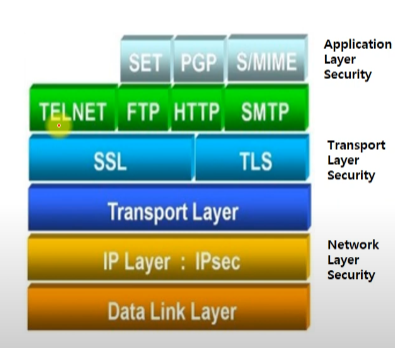

# tls: transport layer security

ssl = secure socket layer

tls1.0 = ssl3.1

ssl tls 차이

tls

- ssl3.0 기초로 IETF가 만든 프로토콜

- TLS1.1에 대칭키 알고리즘으로 AES 추가

ssl

- 1994 Netscape사 제작

- 1995년 3.0 업그레이드

ssl tls 특징

- rsa방식과 x.509 인증서 사용

- 443포트 osi 7layer에서 전송 ~응용계층에서 동작

- 기밀성, 무결성, 인증, 데이터 압축 기능 제공
  
  - 메세지를 단편화한후 합의한 방식으로 압축
  
  - 압축후  MAC(메세지 인증 코드)를 부가 -> reply attack 방어(재전송 공격)
    
    - MAC은 메세지의 해쉬값으로
  
  - 이후 대칭키로 암호화
  
  - 데이터 타입, 버전, 압축한 길이등의 정보를 헤더에 추가

- handshake 프로토콜을 통한 인증 절차 

1. **"client hello"** : 클라이언트가 서버로 hello 메세지를 전송하면서 핸드셰이크를 시작합니다. 이 메세지에는 클라이언트가 지원하는 TLS(SSL) 버전, 지원되는 암호 제품군, 그리고 "client random"이라고 하는 무작위 바이트 문자열이 포함됩니다.
2. **"server hello" :** 클라이언트 hello 메시지에 대한 응답으로 서버가 서버의 SSL 인증서, 서버에서 선택한 암호 제품군, 그리고 서버에서 생성한 또 다른 무작위 바이트 문자열인 "server random"를 포함하는 메시지를 전송합니다.
3. **Verify server certificate** : 클라이언트가 서버의 SSL 인증서를 인증서 발행 기관(CA)을 통해 검증합니다. 이를 통해 서버가 인증서에 명시된 서버인지, 클라이언트가 상호작용 중인 서버가 실제 해당 도메인의 소유자인지를 확인합니다.
4. **Client key exchange** : 확인이 완료되면 클라이언트는 "The premaster secret"라고 하는 무작위 바이트 문자열을 공개 키로 암호화하여 전송합니다. (클라이언트는 서버의 SSL 인증서에서 공개 키를 받습니다.)
5. **Send client certificate** : 만약 서버가 클라이언트의 인증서를 요구한다면 서버의 인증서와 같은 방식으로 암호화를 진행하여 함께 전송합니다.
6. **Verify client certificate** : 서버가 클라이언트로부터 받은 The premaster secret을 개인키를 통해 해독합니다.
7. **Client "finished"** : 클라이언트가 "client random", "server random", "The premaster secret"를 이용해 대칭키로 활용할 "세션 키"를 생성합니다. 클라이언트가 세션 키로 암호화된 "finished" 메시지를 전송합니다.
8. **Server **"finished"**** : 서버가 "client random", "server random", "The premaster secret"를 이용해 대칭키로 활용할 "세션 키"를 생성합니다. 서버가 세션 키로 암호화된 "finished" 메시지를 전송합니다.
9. **Exchange messages** : 핸드셰이크가 완료되고, 세션 키를 이용해 메세지를 주고 받습니다.

이후 통신은 대칭키인 세션을 이용

출처: [W보안넷 : 암호학(Cryptography)-14.1 SSL/TLS - YouTube](https://www.youtube.com/watch?v=iRc2-mW4E3I&t=1698s)
