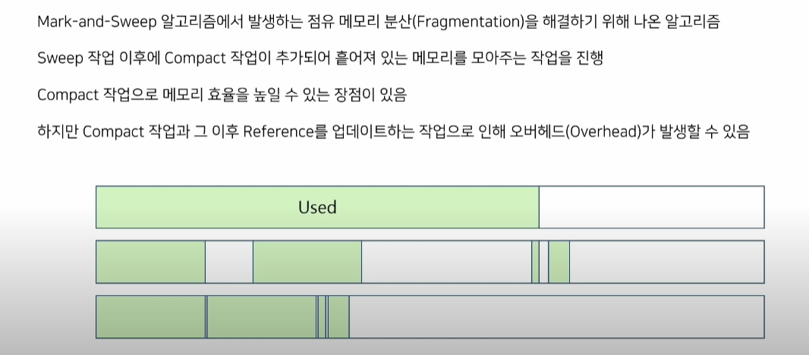

# GC

튜닝 -> stop the world 최소화를 위해

GC 원리

약한 세대 가설

1. 대부분의 객체는 금방 접근 불가능한 상태가 된다

2. 오래된 객체에서 젊은 객체로의 참조는아주 적게 발생
   
   - 싱글톤은요? 특수한 경우에요 dto, dao를 생각하시면 됩니다

알고리즘

1. reference Counting 알고리즘
- 탐색에 초점을 맞춘 알고리즘

- 각 객체마다 reference count를 관리하여 0이 되면 GC

- 순환 참조시 cnt가 0이 안되어 메모리 누수 발생 가능
2. mark and sweap 알고리즘
- 레퍼런스를 추적하여 참조 상황 파악

- mark 단계에서 garbage 대상이 아닌 객체를 마킹

- sweep 단계에서 마킹되지 않은 객체를 지우는 작업 수행

- 위 단계를 마친 후 마킹 정보를 초기화

- GC가 동작하는 동안 mark 작업과 어플리케이션 스레드의 충돌을 방지하기 위해 heap 사용이 제한됨

- compaction 작업이 없어 비어있는 공간이 없으면 out of memory 발생

메모리들을 정리하는 작업 -> compaction(빈공간 을 모으는?)

잠깐만! 마킹하는법

- **마킹 단계**:
  
  - 루트 집합에서 시작하여 도달 가능한 모든 객체를 마크.
  - 깊이 우선 탐색(DFS)이나 너비 우선 탐색(BFS)와 유사한 방식으로 객체 그래프를 탐색.

- **스윕 단계**:
  
  - 힙 메모리를 선형적으로 탐색하며 마크되지 않은 객체를 해제.
  - 마크된 객체는 마크를 해제하여 다음 사이클을 준비.

루트 집합은 프로그램의 실행 스택, 전역 변수, 정적 변수 등이 포함됩니다. 이들로부터 접근 가능한 객체를 기준으로 시작합니다.

3. mark and compact algorithm
- sweep 작업 이후 compact 작업이 추가 되어 있는 메모리를 모아주는 작업을 진행

- compact 작업과 레퍼런스를 업데이트하는 작업으로 인해 오버헤드가 발생할 수 있음
  
  

일반적인 GC 과정

1. 객체를 Eden영역에 생성

2. Minor GC 발생시 미사용 객체 제거와 사용중인 객체는 survivor1,2 로 이동
- 객체의 크기가 서바이버보다 크면 바로 old로 이동
3. 서바이버 둘중 하나는 비어져 있어야한다
- 서바이버 영역이 가득차면 사용중인 객체는 다른 서바이버로

- 안 쓰면 제거
4. 1~3을 반복하면서 오래 살아남은 객체를 old generation으로 이동 (promotion)

5. old generation 영역이 어느 정도 차면 Major GC 발생 ->stop the world

GC  종류

Serial GC

- mark and compact 알고리즘

- 하나의 cpu로  young , old generation 연속적으로 처리

- GC 수행중 stop the world

parallel GC

- 자바 7~8

- 다른 cpu가 GC의 진행 시간동안 대기 상태를 최소화

- GC 병렬적으로 처리

parallel old GC

- old GC도 병렬로 처리

Cocurrent Mark Sweep GC

- 어플리케이션과 GC 의 스레드가 동시에 실행되어 stop the world 최소화

- compact 작업  X -> parallel GC와 차이

G1 GC

- 큰 메모리에서 사용하기 적합한 GC(대규모 heap 사이즈에서 짧은 GC 시간을 보장하기위해 )

- 전체 heap을 Region 영역으로 분할하여 동적으로 부여(young, s1, s2, old가 동적)

Z GC

- zpage라는 영역 사용 (region과 비슷, 크기를 2mb 의 배수로 운영이 차이점)

- 정지시간이 10ms 넘지 않도록하느것이 목적

- 힙 사이즈가 증가해도 정지시간이 증가 X

- 아직은 실험적 
