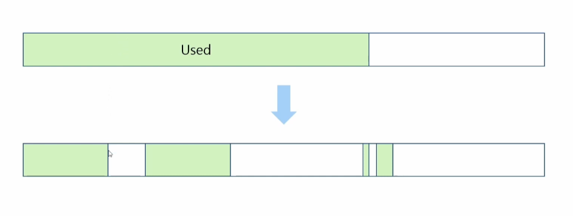

# GC

튜닝 -> stop the world 최소화를 위해

GC 원리

약한 세대 가설

1. 대부분의 객체는 금방 접근 불가능한 상태가 된다

2. 오래된 객체에서 젊은 객체로의 참조는아주 적게 발생
   
   - 싱글톤은요? 특수한 경우에요 dto, dao를 생각하시면 됩니다

알고리즘

1. reference Counting 알고리즘
- 탐색에 초점을 맞춘 알고리즘

- 각 객체마다 reference count를 관리하여 0이 되면 GC

- 순환 참조시 cnt가 0이 안되어 메모리 누수 발생 가능
2. mark and sweap 알고리즘
- 레퍼런스를 추적하여 참조 상황 파악

- mark 단계에서 garbage 대상이 아닌 객체를 마킹

- sweep 단계에서 마킹되지 않은 객체를 지우는 작업 수행

- 위 단계를 마친 후 마킹 정보를 초기화

- GC가 동작하는 동안 mark 작업과 어플리케이션 스레드의 충돌을 방지하기 위해 heap 사용이 제한됨

- compaction 작업이 없어 비어있는 공간이 없으면 out of memory 발생

메모리들을 정리하는 작업 -> compaction(빈공간 을 모으는?)

잠깐만! 마킹하는법

- **마킹 단계**:
  
  - 루트 집합에서 시작하여 도달 가능한 모든 객체를 마크.
  - 깊이 우선 탐색(DFS)이나 너비 우선 탐색(BFS)와 유사한 방식으로 객체 그래프를 탐색.

- **스윕 단계**:
  
  - 힙 메모리를 선형적으로 탐색하며 마크되지 않은 객체를 해제.
  - 마크된 객체는 마크를 해제하여 다음 사이클을 준비.

루트 집합은 프로그램의 실행 스택, 전역 변수, 정적 변수 등이 포함됩니다. 이들로부터 접근 가능한 객체를 기준으로 시작합니다.
