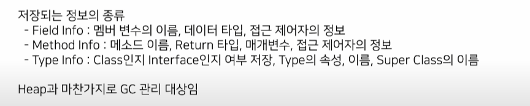

자바 어플리케이션 실행 과정

1. 어플리케이션이 실행시 jvm이 os로부터 메모리 할당

2. 자바 컴파일러가 자바 소스코드를 읽어 바이트 코드로 변환

3. class loader를 통해 jvm으로 로딩

4. 로딩된 바이트 코드는 execution engine으로 해석

5. run time data areas에 배치되어 실행

execution engine

인터프리터

- 바이트 코드를 해석하여 실행하는 역할

- 같은 메소스라도 매번 새로 수행

just in time compiler

- 인터프리터 단점 해소

- 반복되는 코드를 발견시 전체 바이트 코드를 컴파일하고 네이티브(c, cpp,  어셈블리)

Garbage Collector

- 참조되지 않는 메모리 객체를 모아 제거

- System.gc()로 실행할수 있지만 보장 X

Garbage Collector

앞으로 사용되지 않는 객체의 메모리를 garbage

garbage를 정해진 스케줄에 의해 정리하는것을 Garbage collection

stop the world

GC를 수행하기우ㅢ해 JVM이 멈추는 현상

GC를 제외한 모든 스레드 멈춰

여러 GC있음

parallel GC-> 8

9, 10 -> g1

11~ ZGC 설정가능

class loader

.class 파일들을 로드하고 링크를 통해 배치하는 작업을 수행하는 모듈

runtime data Area

Method Area

- static 을 포함한 class 레벨의 모든 데이터 저장

- 단 하나의 method area 존재

- runtime constant pool에 상수 자료형 저장
  
  

Heap Area(java 8)

- new 연산자로 생성된 모든 객체, 인스턴스 변수, 배열 저장

- 영: 생명 주기가 짧은 객체

- eden에 할당후 서바이버 0, 1을 거쳐 올드로 이동

- 올드: 생명주기가 긴 객체를 gC 대상으로 하는 영역

- minor, major GC 있따

- 여러 스레드가 공유하는 메모리

Stack Area

- 각 스레드를 위한 분리된 런타임 스택 영역

- 메소드가 호출할 때마다 스택 프레임이라고 불리는 entry가 스택 area에 생성

- 스레드 종료시 바로 사라짐

PC Register Area

- program Counter 의 줄임말

- 스레드 생성시 하나씩 존재

- 어떤 명령 실행해야 할지에 대한 기록

Native Method Stack

Java Native Interface

jvm이 Native Method를 적재하고 수행하기위해 제공되는 인터페이스
실질적으로 C/Cpp 동작

**jit 와 빌드시 컴파일러는 별개!**
